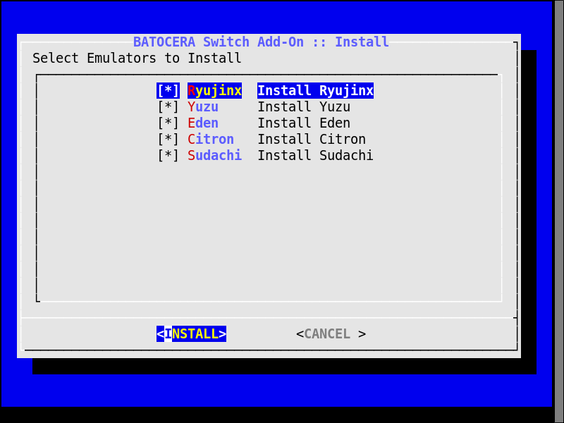
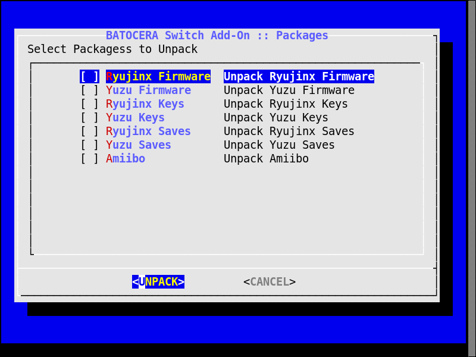
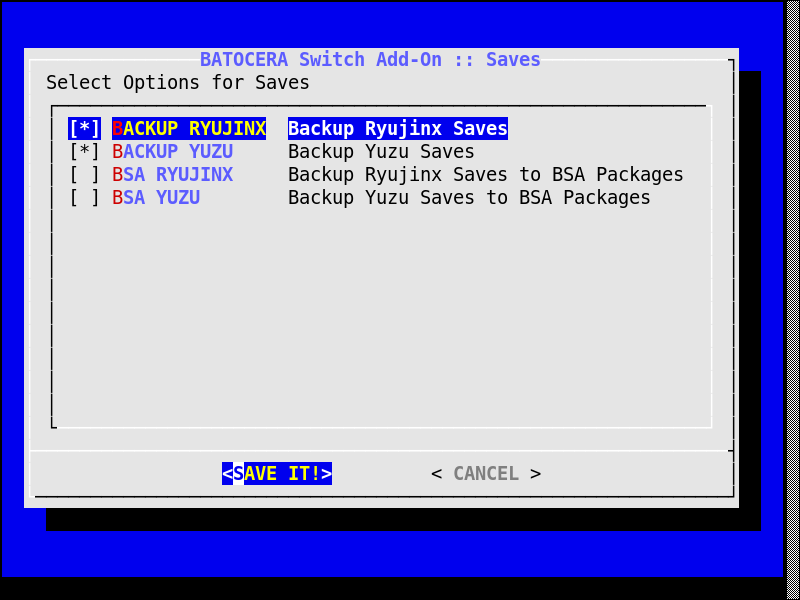
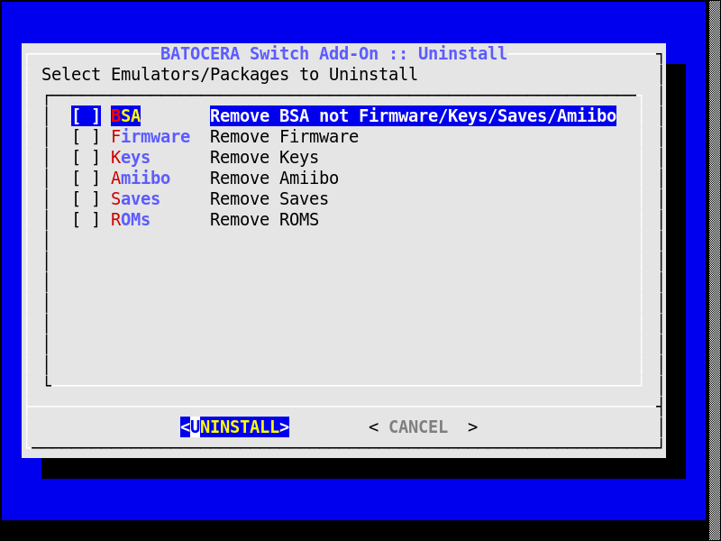

# Batocera Switch Add-on (BSA)

  

**REQUIRED**
- Batocera x86_64
- File System (*userdata*) supporting **symlinking (EXT4, BTRFS)**

  

**CREDITS**

Based on the works of:
- ordovice
- foclabroc
- Batocera Nation
- uureel
- TronFNBlow

  

**INITIAL CHANGES FROM CODE BASE**

- Introduced Text-Base Menu (dialog)
- Completely Offline Option (if you wish)
- Switched to AppImage for All Emulators
- Emulator AppImage Not Found Locally will Attempt to Get Remotely
- Ability to Select Individual Emulators to Install
- Update Emulator AppImage (currently no version tracker - working on it)
- Separate Firmware & Keys for Ryujinx & Yuzu (+Forks)
- Changed Saves to now reflect NAND structure for easier backup
- Backup Saves from Menu (working on restore function)
- Uninstall BSA from Menu
- See File Structures Below

  
 
**NOTE**

DOES NOT INCLUDE
- Firmware
- Keys
- ROMs
- Emulators

  
  

## HOW-TO BSA
- Terminal:
<pre>
curl -sL https://bit.ly/BatoceraToolBoxDream | bash
</pre>
- Put Emulators in '/userdata/BSA/emus' (Optional, as will attempt remote if missing.)
- Put Firmware, Keys, Saves & Amiibo in '/userdata/BSA/packages' (Will skip if missing.)
- Put ROMs in '/userdata/BSA/roms/switch' (Will copy ROMs from BSA to Batocera by default. Used for multiple installs; e.g., BSA stored on external drive.)
- Terminal:
<pre>
cd /userdata/BSA
./BSA.sh
</pre>
**Note**: Install will do a full install including packages, roms, etc.
  
**Remember**: *Update Gamelists* in *Game Settings* from EmulationStation *Main Menu*

  
  

## BATOCERA SWITCH ADD-ON *INSTALLATION* KEY DIRECTORY STRUCTURE
<pre>
/BSA/
│
├── configgen/         # EmulationStation Launcher Generator
│   ├── generators/    # Emulator Specific Generator
│   └── sdl2/          # SDL2
│
├── configs/
│   ├── emulationstation/    # Config for EmulationStation (Adds Switch to the ES Menu)
│   └── evmapy/              # Config for evmapy (evdev event mapper: input event -> action)
│
├── emus/                           
│   │ *** THE FOLLOWING FILES ARE NOT INCLUDED ***
│   ├── citron.AppImage     # Citron AppImage
│   ├── eden.AppImage       # Eden AppImage
│   ├── Ryujinx.AppImage    # Ryujinx AppImage
│   ├── sudachi.AppImage    # Sudachi AppImage
│   └── yuzu.AppImage       # Yuzu AppImage
│
├── icons/    # Icons for Desktop [F1]
│
├── packages/
│   │ *** THE FOLLOWING FILES ARE NOT INCLUDED ***
│   ├── amiibo.zip/              # Amiibo Package
│   │   └── *.bin
│   │
│   ├── firmware-ryujinx.zip/    # Ryujinx Firmware Package (root of zip should contain nca directories)
│   │   └── *.nca/
│   │
│   ├── firmware-yuzu.zip/       # Yuzu Firmware Package (root of zip should contain nca files)
│   │   └── *.nca
│   │
│   ├── keys-ryujinx.zip/        # Ryujinx Keys Package
│   │   ├── dev.keys             # Development Keys (Optional)
│   │   ├── key_retail.bin       # Amiibo Decryption (Optional)
│   │   ├── prod.keys            # Production Keys
│   │   └── title.keys           # Title Keys
│   │
│   ├── keys-yuzu.zip/           # Yuzu Keys Package
│   │   ├── dev.keys             # Development Keys (Optional)
│   │   ├── key_retail.bin       # Amiibo Decryption (Optional)
│   │   ├── prod.keys            # Production Keys
│   │   └── title.keys           # Title Keys
│   │
│   ├── saves-ryujinx.zip/       # Ryujinx Saves
│   │   ├── system/
│   │   │   └── save/
│   │   └── user/
│   │       ├── save/
│   │       └── saveMeta/
│   │
│   ├── saves-yuzu.zip           # Yuzu Saves
│   │   ├── system/
│   │   │   └── save/
│   │   └── user/
│   │       └── save/
│   │
│   │ *** THE FOLLOWING FILES ARE INCLUDED ***
│   ├── libthai.pkg.tar.zst      # Thai Langauge Libraries
│   ├── sdl2-compat.pkg.tar.zst  # SDL2 Libraries
│   ├── sdl3.pkg.tar.zst         # SDL3 Libraries
│   ├── xdg-utils.pkg.tar.zst    # XDG Utils
│   └── xdotool.pkg.tar.zst      # XDO Tools
│
├── roms/         # ROMs
│   ├── ports/    # Adds Sudachi Q-Launcher
│   └── roms/     # Switch ROMs
│
├── scripts/    # Scripts
│
├── BSA.sh               # Main Install Script
├── bsa-emulators.sh     # Emulator Install Functions
├── bsa-functions.sh     # General Functions
├── bsa-initialize.sh    # Initialization Functions (mostly directory structure)
├── bsa-packages.sh      # Unpack Packages Functions (Firmware, Keys, Saves, Amiibo, etc.)
├── bsa-post.sh          # Post-Install Functions (Scripts & Other Misc Tasks Post Install)
├── bsa-uninstall.sh     # Uninstall Functions
├── bsa-variables.sh     # Global Variables
├── install-BSA.sh       # Install BSA
└── README.md            # This Document
</pre>

## BATOCERA SWITCH ADD-ON *INSTALLED* KEY DIRECTORY STRUCTURE
<pre>
/userdata/
├── bios/
│   └── switch/
│       ├── amiibo/              # Amiibo
│       ├── firmware_ryujinx/    # Ryujinx Firmware
│       ├── keys_ryujinx/        # Ryujinx Keys (must match Firmware)
│       ├── firmware_yuzu/       # Yuzu Firmware
│       └── keys_yuzu/           # Yuzu Keys (must match Firmware)
│
├── roms/
│   ├── ports/     # Adds Sudachi Q-Launcher
│   └── switch/    # ROMs here
│
├── saves/
│   └── switch/
│       ├── Ryujinx/             # Ryujinx Saves
│       │   ├── system/
│       │   │   └── save/
│       │   └── user/
│       │       ├── save/
│       │       └── saveMeta/
│       │
│       └── yuzu/                # Yuzu Saves
│           ├── system/
│           │   └── save/
│           └── user/
│               └── save/
│
└── system/
    ├── .configs/
    │   ├── Ryujinx/    # Symlink to /userdata/system/configs/Ryujinx
    │   ├── yuzu/       # Symlink to /userdata/system/configs/yuzu/
    │   ├── eden/       # Symlink to /userdata/system/configs/eden
    │   ├── citron/     # Symlink to /userdata/system/configs/citron
    │   └── sudachi/    # Symlink to /userdata/system/configs/sudachi
    │
    ├── .local/
    │   └── share/
    │       ├── Ryujinx/    # Symlink to /userdata/system/configs/Ryujinx
    │       ├── yuzu/       # Symlink to /userdata/system/configs/yuzu
    │       ├── eden/       # Symlink to /userdata/system/configs/eden
    │       ├── citron/     # Symlink to /userdata/system/configs/citron
    │       └── sudachi/    # Symlink to /userdata/system/configs/sudachi
    │
    └── configs/
        ├── Ryujinx/
        │   ├── amiibo/    # Symlink to /userdata/bios/switch/amiibo
        │   ├── system/    # Symlink to /userdata/bios/switch/keys_ryujinx
        │   │
        │   └── bis/                       # Ryujinx NAND
        │       ├── system/
        │       │   ├── Contents/
        │       │   │   └── registered/    # Symlink to /userdata/bios/switch/firmware_ryujinx
        │       │   └── save/              # Symlink to /userdata/saves/Ryujinx/system/save
        │       └── user/
        │           ├── save/              # Symlink to /userdata/saves/Ryujinx/user/save
        │           └── saveMeta/          # Symlink to /userdata/saves/Ryujinx/user/saveMeta
        │
        ├── yuzu/
        │   ├── amiibo/    # Symlink to /userdata/bios/switch/amiibo
        │   ├── keys/      # Symlink to /userdata/bios/switch/keys_yuzu
        │   │
        │   └── nand/                      # Yuzu NAND
        │       ├── system/
        │       │   ├── Contents/
        │       │   │   └── registered/    # Symlink to /userdata/bios/switch/firmware_yuzu
        │       │   └── save/              # Symlink to /userdata/saves/yuzu/system/save
        │       └── user/
        │           └── save/              # Symlink to /userdata/saves/yuzu/user/save
        │
        ├── eden/
        │   ├── amiibo/    # Symlink to /userdata/bios/switch/amiibo
        │   ├── keys/      # Symlink to /userdata/bios/switch/keys_yuzu
        │   └── nand/      # Symlink to /userdata/system/configs/yuzu/nand
        │
        ├── citron/
        │   ├── amiibo/    # Symlink to /userdata/bios/switch/amiibo
        │   ├── keys/      # Symlink to /userdata/bios/switch/keys_yuzu
        │   └── nand/      # Symlink to /userdata/system/configs/yuzu/nand
        │
        └── sudachi/
            ├── amiibo/    # Symlink to /userdata/bios/switch/amiibo
            ├── keys/      # Symlink to /userdata/bios/switch/keys_yuzu
            └── nand/      # Symlink to /userdata/system/configs/yuzu/nand
</pre>
